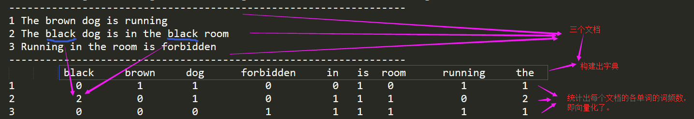
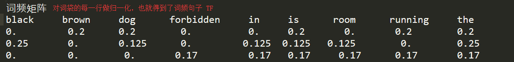

任务：

1. 基本文本处理技能
    1.1 分词的概念（分词的正向最大、逆向最大、双向最大匹配法）；
    1.2 词、字符频率统计；（可以使用Python中的collections.Counter模块，也可以自己寻找其他好用的库）
2. 语言模型
    2.1 语言模型中unigram、bigram、trigram的概念；
    2.2 unigram、bigram频率统计；（可以使用Python中的collections.Counter模块，也可以自己寻找其他好用的库）
3. 文本矩阵化：要求采用词袋模型且是词级别的矩阵化
    步骤有：
    分词（可采用结巴分词来进行分词操作，其他库也可以）；去停用词；构造词表。
    每篇文档的向量化。


3月4日

1.1、最大匹配法：最大匹配是指以**词典**为依据，取词典中最长单词为第一次取字数量的扫描串，在词典中进行扫描。（为提升扫描效率，可以根据字数多少来设计多个词典，然后根据不同的字数直接取扫描对应的词典）然后逐字递减，在对应词典中查找。


1.2、***正向最大匹配法***

| 轮数 | 单轮次数 | 本次划分词语                           | 词典中是否存在 | b本轮最终分词结果 |
| ---- | -------- | -------------------------------------- | -------------- | ----------------- |
| 1    | 1        | 我们在野生动物园                       | 否             |                   |
|      | 2        | 我们在野生动物                         | 否             |                   |
|      | 3        | 我们在野生动                           | 否             |                   |
|      | 4        | 我们在野生                             | 否             |                   |
|      | ...      | ...                                    | ...            |                   |
|      | 7        | 我们                                   | 是             | 我们              |
|      |          | **第二轮分词时去掉上一轮分出来的词语** |                |                   |
| 2    | 1        | 在野生动物园                           | 否             |                   |
|      | 2        | 在野生动物                             | 否             |                   |
|      | ...      | ...                                    | ...            |                   |
|      | 5        | 在野                                   | 是             | 在野              |
|      |          |                                        |                |                   |
| 3    | 1        | 生动物园                               | 否             |                   |
|      | 2        | 生动物                                 | 否             |                   |
|      | 3        | 生动                                   | 是             | 生动              |
|      |          |                                        |                |                   |
| 4    | 1        | 物园                                   | 否             |                   |
|      | 2        | 物                                     | **否**         | 物  <注：非词语>  |
|      |          |                                        |                |                   |
| 5    | 1        | 园                                     | 是             | 园                |

故最后分词结果为： 我们 / 在野 / 生动 / 物 / 园/


1.3、***逆向最大匹配法***

| 轮数 | 单轮次数 | 本次划分词语     | 词典中是否存在 | b本轮最终分词结果 |
| ---- | -------- | ---------------- | -------------- | ----------------- |
| 1    | 1        | 我们在野生动物园 | 否             |                   |
|      | 2        | 们在野生动物园   | 否             |                   |
|      | 3        | 在野生动物园     | 否             |                   |
|      | 4        | 野生动物园       | 是             | 野生动物园        |
|      |          |                  |                |                   |
| 2    | 1        | 我们在           | 否             |                   |
|      | 2        | 们在             | 否             |                   |
|      | 3        | 在               | 是             | 在                |
|      |          |                  |                |                   |
| 3    | 1        | 我们             | 是             | 我们              |

故最终分词结果： 我们 / 在 / 野生动物园


1.4、***双向最大匹配法*** 

正向最大匹配法和逆向最大匹配法，都有其局限性，我举得例子是正向最大匹配法局限性的例子，逆向也同样存在（如：长春药店，逆向切分为“长/春药店”），因此有人又提出了双向最大匹配法，双向最大匹配法。即，两种算法都切一遍，然后根据原则，选取其中一种分词结果输出。

原则：

​	1、颗粒度越大越好

​	2、切分结果中非词典词越少越好，单字字典词数越少越好

​	3、总体词数越少越好，在相同字数的情况下，总词数越少，说明语义单元越少，那么相对的单个语义单元的权重会越大，因此准确性会越高。

|                | 正向最大匹配                 | 逆向最大匹配           |
| -------------- | ---------------------------- | ---------------------- |
|                | 我们 / 在野 / 生动 / 物 / 园 | 我们 / 在 / 野生动物园 |
| 非字典词个数   | 1（物）                      | 0                      |
| 单字字典词个数 | 1（园）                      | 1（在）                |
| 总词数         | 5                            | 3                      |

因此该句子输出 逆向最大匹配法 匹配的句子： 我们 / 在 / 野生动物园


**总结**： 正向、逆向、双向最大分词是最基本的分词方法，但分词准确性并不很高，常常是作为分词的Baseline使用。这类方法的实现比较简单


1.5、python collections模块的 Counter类 介绍：http://www.pythoner.com/205.html

​	Counter类的目的是用来跟踪值出现的次数。它是一个无序的容器类型，以字典的键值对形式存储，其中元素作为key，其计数作为value。计数值可以是任意的Interger（包括0和负数）。Counter类和其他语言的bags或multisets很相似。

```python
from collections import Counter
c = Counter()  # 创建一个空的Counter类
c = Counter({'a': 4, 'b': 2, 'c':1})  # 从一个字典对象创建
c = Counter(a=4, b=2,c=1)  # 从一组键值对创建
c = Counter('abcaaba')  # 从一个可iterable对象（list、tuple、dict、字符串等）创建
print(c)
#Counter({'a': 4, 'c': 1, 'b': 2})

#取各词的计数
print(c['a']) # 4

#各词频数从大到小排序获取
l = c.most_common()
print(l) # [('a', 4),  ('b', 2), ('c', 1)]
print(c.most_common(2)) # [('a', 4),  ('b', 2)]

#词频更新
c = Counter(['a','int'])
c.update(['a','apple'])
print(c) #Counter({'a': 2, 'int': 1, 'apple': 1})
```


2.1、unigram、bigram、trigram的概念

| unigram | 一元分词 | 把句子分成一个字                   |
| ------- | -------- | ---------------------------------- |
| bigram  | 二元分词 | 把句子从头到尾每两个字组成一个词语 |
| trigram | 三元分词 | 把句子从头到尾每三个字组成一个词语 |

bigram 示例：

​		我们在打球 -->  我们，们在，在打，打球

​		we are very lucky. --> we are，are very， very lucky

trigram示例：

​		我们在打球 --> 我们在，们在打，在打球

​		we are very lucky. --> we are very ，are very lucky

以上也可以用在字符级别。

更多N-gram模型详解：https://blog.csdn.net/baimafujinji/article/details/51281816


3.1、词袋模型，TF-IDF概念：






最后TF-IDF就是词频矩阵乘以逆文档频率（有的公式是先对IDF取对数）


### 3.2、对cnews训练数据进行词袋化：cnews_words_bag.ipynb


